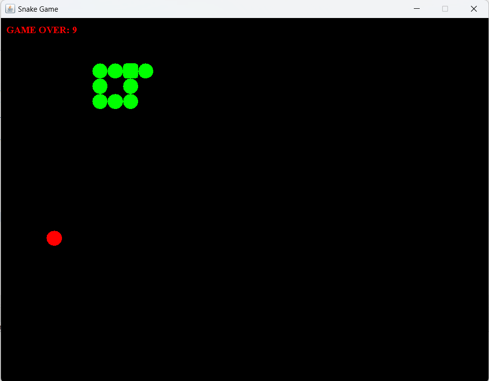

# Snake Game

This is a classic Snake game implemented in Java using the Swing framework for the graphical user interface.

## Table of Contents

- [Introduction](#introduction)
- [Features](#features)
- [How to Play](#how-to-play)
- [Project Structure](#project-structure)
- [Technologies Used](#technologies-used)
- [Setup Instructions](#setup-instructions)
- [Contributing](#contributing)

## Introduction

Snake Game is a simple yet addictive game where the player controls a snake that moves around the game board. The snake grows longer as it eats food items placed randomly on the board. The game ends if the snake collides with itself or the boundaries of the board.

## Features

- Classic snake gameplay with intuitive controls.
- The snake's length increases when it eats food.
- Randomly placed food items on the game board.
- Score display showing the length of the snake.

## How to Play

1. Use the arrow keys (up, down, left, right) to control the direction of the snake.
2. Eat the food items (red dots) to grow longer.
3. Avoid colliding with the snake's own body or the boundaries of the game board.
4. Try to achieve the highest score possible!

## Project Structure

The project is organized as follows:

- `SnakeGameApp.java`: Main class to start the game.
- `SnakeGame.java`: Swing JPanel subclass for the game board and logic.
- `Snake.java`: Class representing the snake object and its behavior.
- `Food.java`: Class representing the food object and its placement.
- `Point.java`: Utility class representing a point on the game board.
- `GameConst.java`: Interface containing game constants.

## Technologies Used

- Java
- Java Swing

## Setup Instructions

1. Clone the repository:
2. Open the project in your preferred Java IDE.
3. Compile and run the `SnakeGameApp.java` file.
4. Use the arrow keys to control the snake and enjoy the game!

## Contributing

Contributions are welcome! If you'd like to contribute to this project, feel free to open a pull request or submit an issue.

